# Chatdex — Current-State Reconnaissance

**Date:** 2026-08-22, visual pass added 2026-08-23 · **HEAD:** `3552a0a` (clean working tree before and after this pass) · **Method:** read-only code/doc inspection + existing test/typecheck/lint runs + a read-only visual pass of the running app. **No source files were modified; the only additions are this document and `docs/recon-screenshots/` (17 images, added at the user's request).**

**Visual inspection status:** completed 2026-08-23 (initially unavailable; the Chrome extension was connected the next day). Both dev servers were already running and healthy (frontend `:4000` → HTTP 200, backend `:3003/health` → `{"status":"ok"}`). Every sidebar route plus the workbench, a project panel, and the orphaned docs page were rendered against the user's real local data and screenshotted — see **§2a Visual inspection** and `docs/recon-screenshots/`. The pass was kept read-only: no buttons that write data were clicked (the workbench was opened by direct URL to an *existing* draft case after verifying in code that visiting it does not auto-create records; anchor/case ids were fetched with a read-only IndexedDB query). Statements from this pass are labeled **[OBSERVED]**.

**Evidence legend** (same convention as `docs/territories/`):

```
[CODE]      directly observed in implementation
[TEST]      established by a test
[DOC]       claimed by documentation
[OBSERVED]  seen in the running app against real data (2026-08-23 visual pass)
[INFERRED]  reasoned from available evidence
[UNKNOWN]   not currently established
```

A prior full-repo atlas exists at `docs/territories/README.md` (built 2026-08-17 against `63d7012`). It predates the entire Decision Investigation feature (all DI commits are 2026-08-18); `git diff 63d7012..HEAD` shows essentially only DI files changed, so the atlas remains reliable for everything *except* investigation — and one of its claims was re-verified false in this pass (see §9, env files).

---

## 1. Current-state summary

Chatdex is a local-first React 19 + Vite SPA (Dexie/IndexedDB as source of truth) with an optional Fastify backend that is a blind ciphertext blob store plus a transit-only LLM relay. **Three knowledge systems coexist at different levels of liveness** [CODE]:

1. **Shared Understanding Workspace** (U0–U6, Aug 2026) — LLM-assisted project discovery, understanding objects/events, human review, living-document projection, chat-context injection. Live; the app's newest large feature before DI.
2. **Decision Investigation** (DI-0–DI-4, 2026-08-18) — deliberately LLM-free provenance workbench: derived code-change anchors, three-region workbench, exhibits with content-hash locators, immutable verdict revisions, ledger, coverage. Live and the best-locator-engineered code in the repo.
3. **AIPKMS / Knowledge** (Apr 2026) — only the anchors-bookmark slice is live (`/knowledge`); threads, workspaces, synthesis, and relevance are dead library code kept green by their own tests. Frozen for ~4 months.

The detection layer (loop / verification-absence / silent-reversion detectors, Web Worker, golden traces) is complete and client-side per the CLAUDE.md invariants, but **has no dedicated route** — it surfaces inside Browse, Analytics (bottom of page), Settings, and a nav-orphaned docs page.

Health snapshot: typecheck clean; **639 frontend + 6 backend tests, all green** [TEST]; lint has 45 problems, mostly in build artifacts (`backend/dist/`, `coverage/`) plus a handful of real source files; both dev servers run. Structural frictions that repeatedly surfaced: no reactive data layer (zero `liveQuery` use — every page hand-refreshes), three divergent conversation-delete cascade paths, a six-registry hand-maintained sync opt-in per record type, four coexisting notions of "project", three of "anchor", and conversations frozen at import (grown session files are silently skipped).

---

## 2. Surface / route inventory (A)

Router: single `<BrowserRouter>` in `src/App.tsx:20-46`; all 15 child routes eager, none guarded, none commented out; **no 404 catch-all** (unknown paths render empty chrome) [CODE]. `src/main.tsx` renders and does nothing else — no boot orchestration, theme hydration, or store hydration [CODE].

| Route | Nav label (Sidebar `src/components/layout/Sidebar.tsx:19-30`) | Entry component | Purpose | Primary actions | Data read | Data written | Status |
|---|---|---|---|---|---|---|---|
| `/` | — | redirect → `/search` (`App.tsx:24`) | index redirect | — | — | — | live |
| `/search` | Search | `src/pages/SearchPage.tsx` | fuzzy full-text search (conversation-level) | query (`?q=`), source filter, open result | Fuse index over `conversations.fullText`; `appStore.isPro` | — | live |
| `/timeline` | Timeline | `src/pages/TimelinePage.tsx` | activity feed | filters, Export JSON/CSV | `db.activities` | — | **dead-ended: table has no writer** (see §7) |
| `/analytics` | Analytics | `src/pages/AnalyticsPage.tsx` | usage stats **+ embedded detector observability** | Recompute, Refresh, Export CSV | `db.dailyStats`, `db.findings`, `db.detectorRuns` | `db.dailyStats` | live; double-purpose surface |
| `/conversations` | Browse | `src/pages/ConversationsPage.tsx` | conversation list | source/tag filters, batch tagging, load more | `db.conversations`, `db.tags`/`entityTags`, finding summaries | `db.entityTags` | live |
| `/conversations/:id` | (same item) | `ConversationsPage` → `ConversationView` | read one conversation | Analyze/Re-analyze, tag, export MD/JSON, in-page search, jump-to-finding, anchor a message | `db.messages`, `db.findings`, `db.detectorRuns`, `db.anchors` | `db.findings`, `db.detectorRuns`, `db.anchors`, `db.entityTags` | live |
| `/chat/:id?` | Chat | `src/pages/ChatPage.tsx` | native LLM chat, optionally project-scoped (`?project=`) | send/stop/regenerate, provider/model select, disclosure modal, inline reconcile | chats (`source:'chatdex'`), `understandingProjects/Objects/Events`, provider creds in `db.metadata` | `db.conversations`, `db.messages`, understanding tables (reconcile) | live |
| `/knowledge` | Knowledge | `src/pages/KnowledgePage.tsx` | AIPKMS anchor library | search/filter, tag + folder CRUD, delete anchor | `db.anchors`, `db.tags`, `db.knowledgeFolders` | same | live but partial — **Edit is a shipped no-op TODO** (`KnowledgePage.tsx:68-70`) |
| `/investigate` | Investigate | `src/pages/InvestigatePage.tsx` | neutral chronological anchor browser + Coverage tab | 7 filters, Derive anchors (backfill), Start/Resume investigation | `db.investigationAnchors`, `db.investigationCases`, `db.rawSources` | `db.investigationAnchors`, `db.investigationCases` | live |
| `/investigate/:anchorId` | (deep link only) | `src/pages/InvestigationWorkbenchPage.tsx` | 3-region workbench (transcript / code event / notebook) | literal search, j/k/[/] nav, pin exhibits, mark reviewed range, finalize verdict | 6 investigation tables + conversation/messages | `investigationCases`, `caseExhibits`, `reviewScopes`, `verdictRevisions` | live |
| `/ledger` | Ledger | `src/pages/LedgerPage.tsx` | finalized-verdict ledger | filters, Open investigation | `verdictRevisions` + joins | — | live (read-only) |
| `/projects` | Projects (+ pending badge) | `src/pages/ProjectsPage.tsx` | discovery + review inbox | Discover projects (LLM, disclosure-gated), accept/reject project/association | all 4 understanding tables, `db.conversations` | all 4 understanding tables | live |
| `/projects/:id` | (deep link only) | `src/pages/ProjectUnderstandingPage.tsx` | living understanding: Panel / Document / Map | Update understanding (reconcile), review objects/events, bulk-accept support, export living doc, → Chat | understanding tables | `understandingObjects`, `understandingEvents` | live |
| `/projects/unassigned` | (link only) | same component, sentinel id (`ProjectUnderstandingPage.tsx:49`) | null-project bucket | subset of above | same | same | live |
| `/import` | Import | `src/pages/ImportPage.tsx` | Claude.ai ZIP / Claude Code JSONL ingest | dropzones, folder handle, resume/forget | files | `conversations`, `messages`, `activities`, `rawSources`, `investigationAnchors` | live; only data entry point |
| `/settings` | Settings (footer) | `src/pages/SettingsPage.tsx` | prefs, cloud sync/vault, detection config, LLM creds, license, danger zone | theme, sync/vault ops, re-analyze all, clear data | `db.metadata`, counts | `db.metadata`, deletes everywhere | live (theme buttons buggy — §7) |
| `/how-detection-works` | **no nav item** | `src/pages/HowDetectionWorksPage.tsx` | detector docs | none | — | — | live but nav-orphaned (2 deep links only) |

**Navigation details** [CODE]: Sidebar hides entirely when `appStore.sidebarOpen` is false (state not persisted). Command palette (⌘K, `CommandPalette.tsx:15-23`) covers only 7 destinations — **missing `/chat`, `/investigate`, `/ledger`, `/projects`**. Header has two dead buttons ("Sync data", "Upgrade to Pro" — no onClick). Every internal link target resolves; no unrouted page files exist.

**Data-inaccessibility risk if a surface is removed/relocated** [CODE unless noted]:

- `/timeline` → only UI over `db.activities` (already writer-less).
- `/analytics` → only UI over `db.dailyStats` **and** the only mount of the detector observability dashboard.
- `/conversations/:id` → the **only per-finding evidence reader** (`EvidencePanel`) and only per-conversation analyze trigger.
- `/knowledge` → only UI over anchors-as-a-library and `db.knowledgeFolders`.
- `/investigate*` → only UI over `investigationAnchors`, `caseExhibits`, `reviewScopes`; only writer of `verdictRevisions`.
- `/projects*` → only UI over all four understanding tables.
- `/settings` → only UI for vault/sync, provider credentials, detection config, licensing.
- `/import` → only data entry point; removal makes the app read-only [INFERRED].
- `db.rawSources` has **zero UI readers anywhere** — no surface shows or manages retained raw sources [CODE].

Click path through the running app: land on `/search` → sidebar to any surface; investigation loop is `/import` → `/investigate` (Derive anchors if pre-existing data) → pick anchor → `/investigate/:anchorId` → finalize → `/ledger` [CODE, spec §18 script at `docs/DECISION-INVESTIGATION-IMPLEMENTATION-REPORT.md:63-78`] — confirmed navigable end-to-end in the visual pass except the finalize step, which was deliberately not exercised (it writes a verdict) [OBSERVED].

---

## 2a. Visual inspection (2026-08-23) — real-data state of every surface

All screenshots in `docs/recon-screenshots/`. App rendered in dark theme; Settings shows Appearance = **System** selected. Everything below is [OBSERVED] unless noted.

**Live data volumes at inspection time:** 50 conversations in Browse (sources: Claude Code sessions across 7 projects + 1 Chatdex chat); **1,385 investigation anchors** ("1385 of 1385"); **2 investigation cases, both `draft`** (read-only IndexedDB query); **0 finalized verdicts** (Ledger empty); **0 AIPKMS anchored items** (Knowledge empty); **0 activities** (Timeline empty); **11 understanding projects, all awaiting review**, sidebar badge pegged at **99+** pending reviews; 364 findings across 55 analyzed sessions.

| Surface | Screenshot | Observed state |
|---|---|---|
| Search | 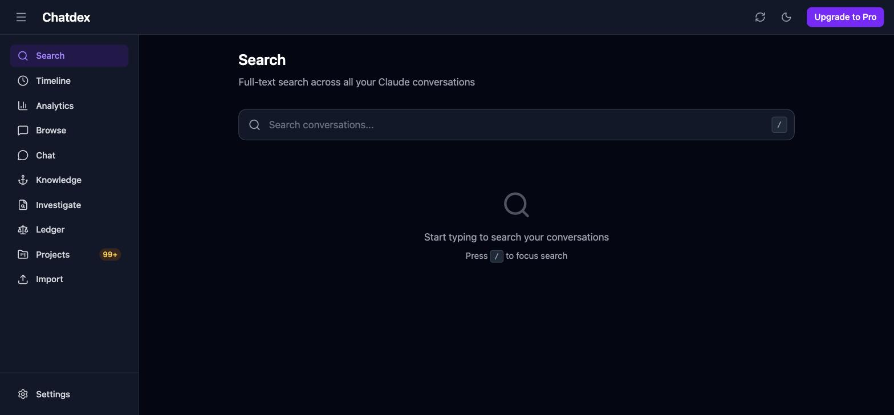 | Clean empty-state prompt; `/` shortcut hint. Header shows the two dead buttons ("Sync data" icon, "Upgrade to Pro") and **no conversation-count badge despite 50 conversations** — confirming the count-hydration gap (§7). |
| Timeline | 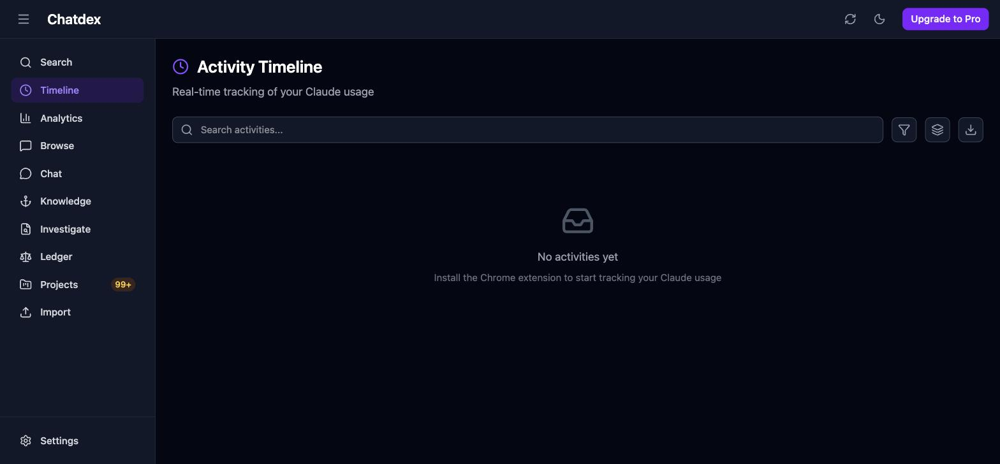 | "No activities yet — Install the Chrome extension to start tracking" — **the dead surface confirmed live-empty with real data present everywhere else.** |
| Analytics (top) | 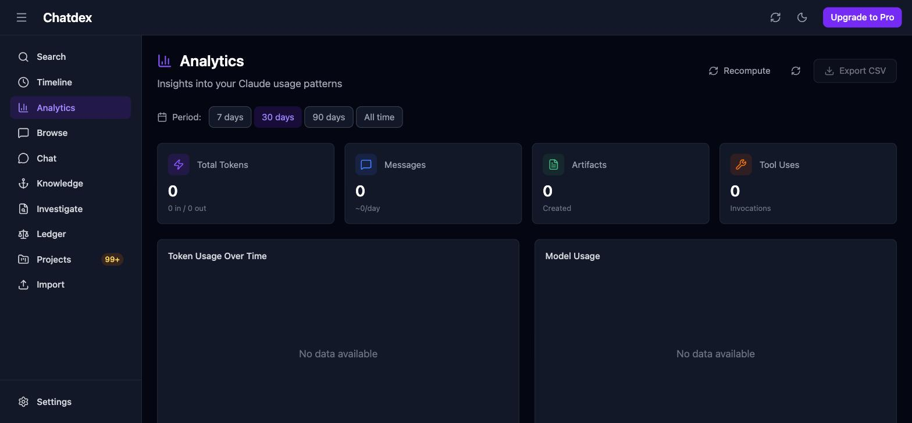 | Default 30-day period shows **all zeros** (Total Tokens 0, Messages 0, "No data available" charts) even though 50 conversations exist — the stale-`dailyStats`/manual-Recompute behavior visible to the user on every visit. |
| Analytics (scrolled) | 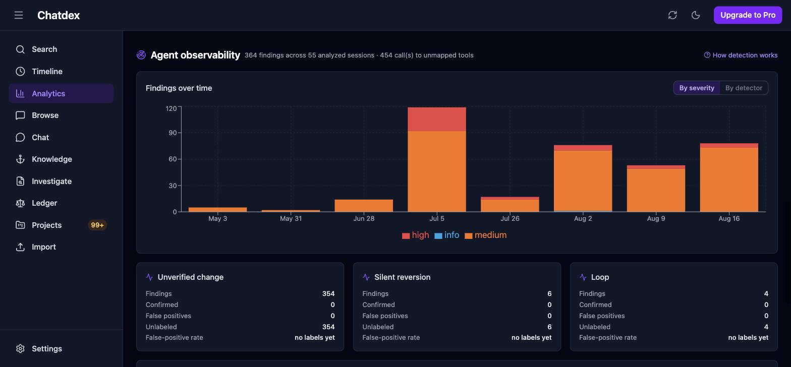 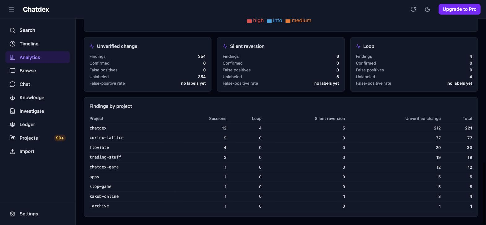 | The **Agent observability dashboard is healthy and populated**: 364 findings / 55 sessions / 454 unmapped tool calls; per-detector cards (Unverified change 354, Silent reversion 6, Loop 4 — **all unlabeled, "no labels yet"**, so FP-rate is empty); findings-by-project table keyed by `projectPath` basename. The zeros-above/rich-below contrast makes the "two products on one scroll" overlap tangible. |
| Browse | 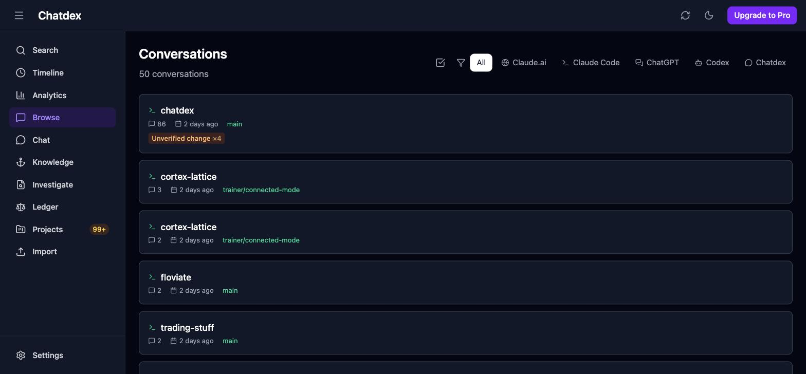 | 50 conversations, source filter chips (All / Claude.ai / Claude Code / ChatGPT / Codex / Chatdex), finding chips on cards ("Unverified change ×4"), git-branch labels. |
| Conversation detail | 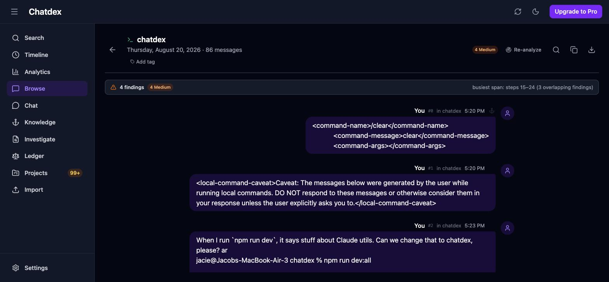 | Findings banner ("4 findings · 4 Medium · busiest span: steps 15–24 (3 overlapping findings)"), Re-analyze, per-message anchors, full transcript renders — including raw `<command-name>`/caveat message internals shown verbatim. |
| Chat | 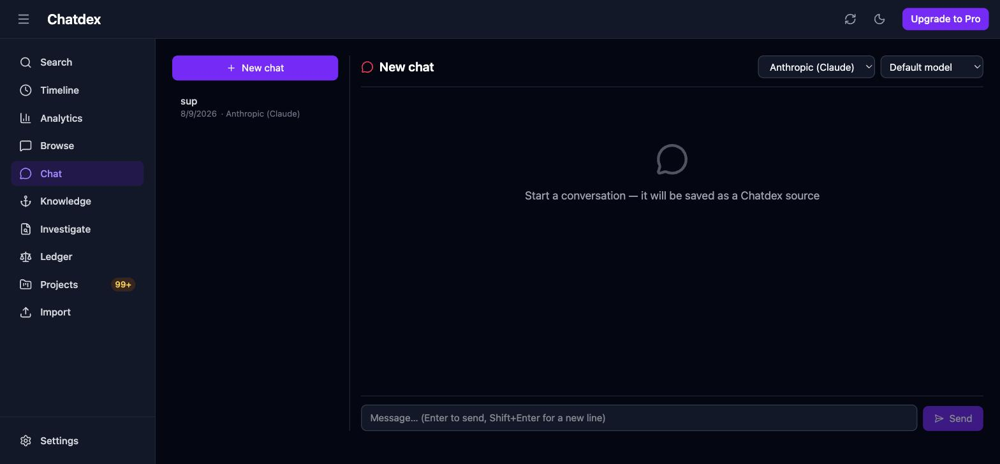 | Live; one existing chat ("sup", 8/9, Anthropic); provider + model selectors; "saved as a Chatdex source" empty-state copy. |
| Knowledge | 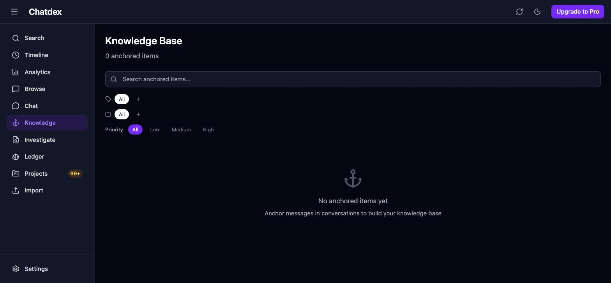 | **"0 anchored items / No anchored items yet."** The live AIPKMS slice holds no real user data — directly relevant to pressure point P2. |
| Investigate | 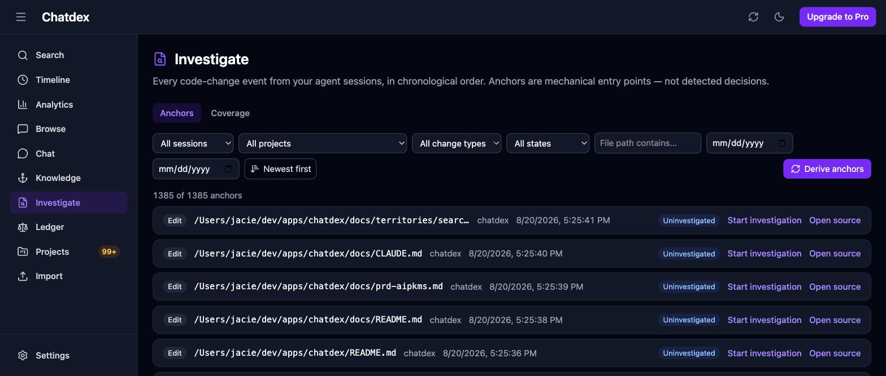 | 1,385 anchors, chronological, all visible rows Uninvestigated; 7 filters populated from real data (27 sessions, 7 projectPaths); the neutral-language header copy renders as specified. |
| Workbench | 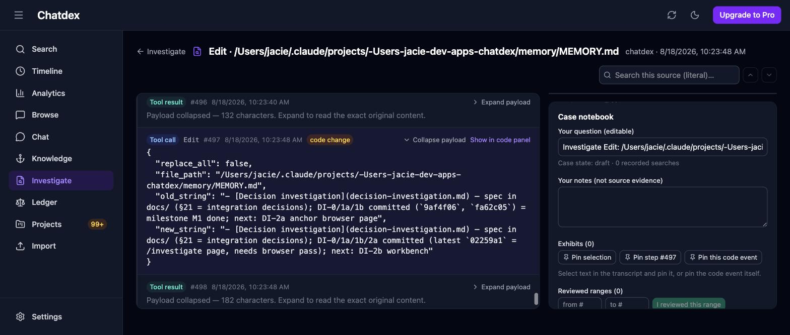 | Opened an existing draft case by URL. Three regions render: virtualized transcript with collapsed tool payloads + "code change" chip, literal search box, Case notebook (editable question, notes, Pin selection / Pin step / Pin code event, reviewed-ranges input). Case state `draft · 0 recorded searches`. |
| Ledger | 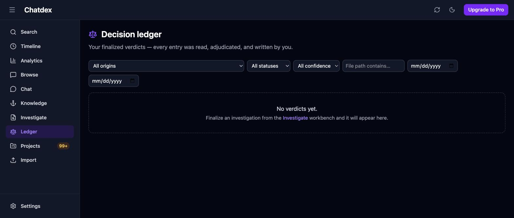 | "No verdicts yet." — consistent with the §18 manual QA pass not yet having been run. |
| Projects | 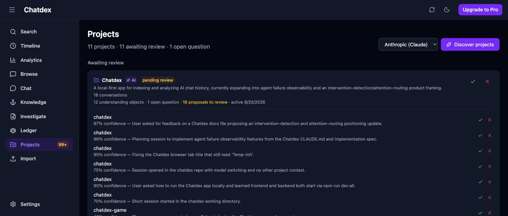 | "11 projects · 11 awaiting review · 1 open question". Top card: AI-discovered "Chatdex" project (pending) with 18 conversations, 12 objects, 16 proposals; per-association accept/reject rows with confidence + rationale. The **sidebar badge reads 99+** while this header says 11 awaiting review — the badge counts objects/events too, and the volume corroborates the discovery-rerun object-duplication generator (§4). |
| Project panel | 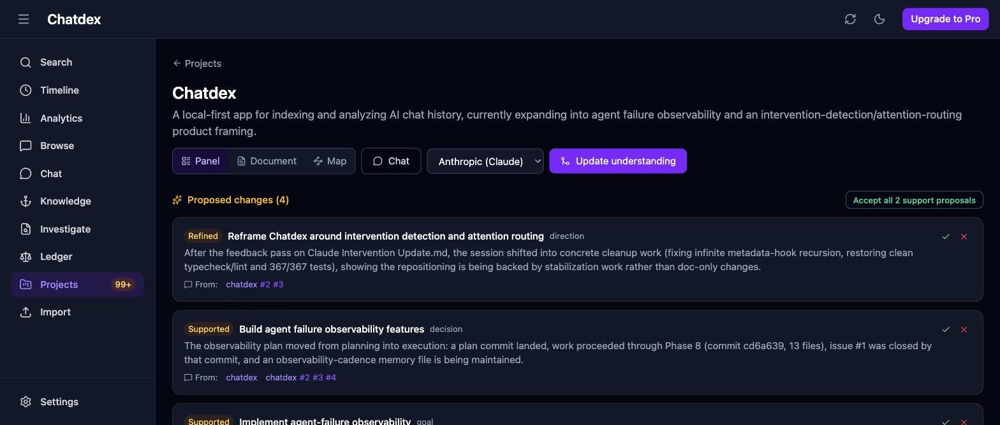 | Panel/Document/Map toggle, Chat link, provider select, "Update understanding", "Proposed changes (4)" with Refined/Supported chips, evidence links ("From: chatdex #2 #3"), bulk "Accept all 2 support proposals". The AI-written project description and event details render coherently against real history. |
| Import | 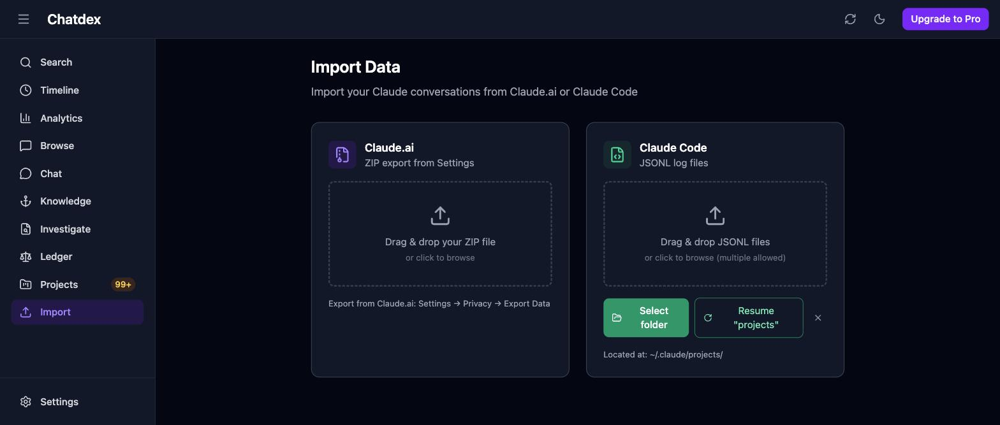 | Two dropzones; Claude Code folder handle remembered — **Resume "projects"** (`~/.claude/projects/`) with a forget ×. |
| Settings | 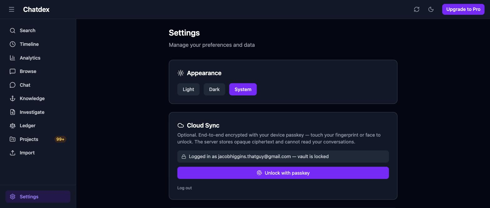 | Appearance (System active), Cloud Sync: **"Logged in as jacobhiggins.thatguy@gmail.com — vault is locked"** + "Unlock with passkey" — i.e. real auth exists, sync gated on unlock, matching §6's locked-vault behavior. |
| How detection works | 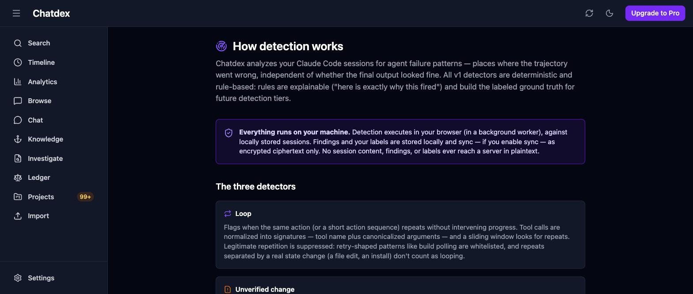 | Renders fine when reached by URL; remains unreachable from any nav [CODE]. |

**Facts this pass adds beyond the code reading:** (a) the Knowledge/AIPKMS anchor table is empty in practice — a merge/retire decision risks no real user data; (b) Timeline is empty in practice, not just in theory; (c) Analytics greets the user with zeros while the observability half below is rich — the overlap is a first-impression problem, not just an architectural note; (d) all 364 findings are unlabeled, so the detector feedback loop (`userLabel`) is unused so far; (e) the 99+ Projects badge vs "11 awaiting review" shows the pending-review queue is dominated by object/event proposals; (f) header conversation-count badge absent with 50 conversations present, confirming the hydration gap live.

---

## 3. Project model and data-ownership map (B)

### Four coexisting "project" notions [CODE]

| Concept | Where | Nature |
|---|---|---|
| `UnderstandingProject` | `src/types/understanding.ts:29-45`, Dexie `understandingProjects` (v3) | canonical app-level project; AI-discovered |
| `StoredConversation.projectPath` | `src/types/unified.ts:42` | Claude Code cwd string; display/stats only; **never linked to `UnderstandingProject`** |
| `ChatProviderMeta.projectId` | `src/lib/chat/chats.ts:23` | chat's "home" project inside the untyped `providerMeta` blob |
| AIPKMS `Workspace` | `src/lib/aipkms/types.ts:41` | **no Dexie table exists**; `anchors.workspaceId` is an indexed column pointing at nothing |

The collision is acknowledged in a code comment (`types/understanding.ts:5-6`).

### Canonical type and lifecycle [CODE]

- **Creation:** only via LLM discovery (`src/lib/understanding/discovery.ts:328-348 ensureProject`, case-insensitive name match) — **no manual project creation UI exists anywhere**. No editing UI (name/description immutable from UI; `'edited'` review state has no producer). **No project deletion exists** — no delete function, no button; only `clearAllData`, sync tombstones, and cascade paths remove rows.
- **Review:** `pending → accepted | rejected` via `ReviewButtons`; rejection is soft (rows kept, filtered out of assemblies) and irreversible from the UI. A rejected project's page stays reachable by URL (`currentUnderstanding.ts:185-190` never checks reviewState).
- **Association:** dedicated join table `projectAssociations` with unique `&[projectId+conversationId]` (`src/lib/db/schema.ts:85`). Created by (1) discovery (`pending`), (2) starting a chat from a project (`accepted`, `confidence:1`, same transaction — `chats.ts:96-112`), (3) sync pull.
- **Multi-project membership is structurally supported and intended** [CODE][TEST `src/lib/db/understanding.test.ts:81`] — but see the reconcile-stamp bug below.
- **Active project = route param only.** No Zustand project store exists; `/projects/:id` with sentinel `'unassigned'` → `projectId = null` (`ProjectUnderstandingPage.tsx:49,211-212`); chat uses `?project=` then `providerMeta.projectId`.

### Where projectId is enforced [CODE]

At the Dexie boundary: association lookups by `projectId`/`conversationId` indexes; objects by `[projectId+status]` compound (`db/understanding.ts:248-253`). In memory only: the null-project bucket (Dexie can't index null — full-table `.filter()`, `db/understanding.ts:242-246`); overview/pending-review assemblies (`overview.ts:170-178`, `pendingReviews.ts:63-71` — full `.toArray()` scans); chat rail scoping (`chats.ts:243-249` reads the unindexed `providerMeta.projectId` and **ignores the association table entirely**); all rejected-row filtering. The backend has zero project knowledge — projects are opaque sync kinds only.

### Cross-project defects observed [CODE unless noted]

1. **Shared-conversation reconcile skip:** `providerMeta.reconciledAt` is per-conversation, not per-(project, conversation) (`reconcile.ts:292-297,333,404-419`). Project A reconciling a shared chat stamps it; project B then skips it until it changes or a full re-run. Corroborated by `docs/territories/synthesize-understanding.md:168` [DOC]. No test covers two projects sharing one chat.
2. **Dual membership channel with no reconciliation:** a chat's project lives in both `providerMeta.projectId` (singular, drives chat context + rail) and N `projectAssociations` rows (drives reconciliation). Rejecting the association does not touch `providerMeta` — they can disagree [CODE + INFERRED].
3. **Local conversation delete orphans associations:** `deleteConversation` (`src/lib/db/conversations.ts:40-74`) cascades to 9 tables but not `projectAssociations`; the sync-applied delete path *does* cascade them (`engine.ts:101`) → devices diverge. `deleteAssociationsForConversation` exists and is tested but has no non-test caller. UI shows `'(deleted conversation)'` (`ProjectsPage.tsx:111`).
4. **Discovery matches against rejected projects** (`discovery.ts:303` loads all projects regardless of reviewState) — a rejected project silently keeps absorbing new associations/objects that no surface can ever show.
5. **Rejecting a project doesn't cascade** to its objects/events/associations — they stay `pending` forever, invisible.
6. **Cross-project events are possible by convention only** — `recordUnderstandingEvent` never checks project ownership (`db/understanding.ts:163-198`).
7. **Duplicate project names structurally allowed** (`name` indexed non-unique) + in-memory dedupe → concurrent discovery runs can duplicate projects or throw `ConstraintError` [CODE + INFERRED].
8. Cursor limitation documented in the type itself (`types/understanding.ts:36-41`); UI auto-falls-back to full re-run (`ProjectUnderstandingPage.tsx:291-300`).

### Sync participation [CODE]

All four understanding tables sync encrypted (`SyncKind`s in `syncApi.ts:26-29`; envelopes `serializer.ts:209-286`; hooks `engine.ts:519-525`). Associations are parented to the **conversation**, not the project. `rawSources` and `investigationAnchors` are deliberately local-only.

---

## 4. Understanding & knowledge systems (C)

### Lifecycle map [CODE]

- **Discovery:** `/projects` → disclosure modal → `runDiscoveryInBatches` (25 convs/batch) → one LLM call per batch (`discovery.ts:306`) → parse with hallucination firewall (drops unknown conversation ids, invented message indexes, evidence-less objects) → persist projects/associations/objects, all `origin:'ai', reviewState:'pending'`. Projects and associations dedupe; **objects never dedupe — every re-run creates fresh objects** ([CODE `discovery.ts:396`] [DOC `UNDERSTANDING-BUILD-LOG.md:180-183`]).
- **Understanding objects:** open-ontology `type`; two orthogonal axes — `reviewState` (human gate) and denormalized `status: 'current'|'superseded'|'resolved'` projected from the event stream (`OP_STATUS`, `db/understanding.ts:137`). **No object versioning or revision rows; no editor exists.** Structural invariants: AI object/event without evidence throws; object + `introduced` event written in one transaction; event review is one-shot (re-review throws, `db/understanding.ts:216-220`); no update/delete helpers for events.
- **Understanding events:** append-only stream, 7 ops, two clocks (`occurredAt` = coarse per-conversation source time derived from evidence conversations' `updatedAt`; `createdAt` = analysis time). Generated only by object creation (`introduced`, always auto-`accepted`) and reconciliation (`reconcile.ts:500`).
- **Human review:** `ReviewButtons` (accept/reject only) across `ProjectReviewCard`, object cards, `PendingChangeCard`, plus bulk-accept restricted to `supported` ops. Rejection keeps rows as audit trail; nothing lists rejected rows → un-reject impossible from UI ([DOC gap acknowledged `UNDERSTANDING-BUILD-LOG.md:134`]).
- **Current Understanding / living document:** pure projections, **never stored** — regenerated per render (`ProjectUnderstandingPage.tsx:342-348`), deterministic contract (caller-supplied timestamp), markdown with citation footnotes; exportable via generic `LivingDocumentView`.
- **Chat-context injection:** `buildProjectContext` renders the living document with `includePending:false` (accepted understanding only), 4-token-budget shrink ladder + hard cut, injected as a system message per send (`ChatPage.tsx:323-325`), reloaded fresh before every send, fully user-visible in `ContextPanel`, first use disclosure-gated. Chats started from a project write a pre-accepted association → the chat re-enters reconciliation (closed loop).
- **AIPKMS/Knowledge:** only anchors + folders are live (`/knowledge`, `AnchorModal` via message shift-click). `threads.ts`, `workspaces.ts`, `synthesis.ts`, `relevance.ts` are **dead** — zero non-test callers; `buildSynthesisPrompt` is a never-called LLM prompt library. `AnchoredItem.tags`/`autoTags` are vestigial always-empty columns that still sync (live code uses `entityTags` instead — `api.ts:697-716,247-250`). Last touched 2026-04-08 vs understanding 2026-08-09 [CODE, git].

### Duplicated concepts across the three systems [CODE]

| Concept | Understanding | Investigation | AIPKMS |
|---|---|---|---|
| "anchor" | `EvidenceRef` (conv + messageIds, in event blob, synced) | `InvestigationAnchor` (derived, local-only) | `AnchoredItem` (human bookmark, synced) |
| evidence granularity | message-level ids in JSON blob, no integrity | character-offset spans + SHA-256 content hashes, mismatch-detected | raw text copy, no locator |
| history | append-only event stream (event-sourcing) | append-only `VerdictRevision` snapshots (`&[caseId+revisionNumber]`) | none |
| lifecycle vocab | `current/superseded/resolved` + review states | `draft/open/adjudicated/reopened` + `VerdictStatus` incl. `superseded` | priority/folder |
| note field | `EvidenceRef.note` (never populated), `event.detail`, `object.body` | exhibit `note` | `annotation` |
| tags | none (EntityType excludes understanding entities) | none | `entityTags` (live) + dead string arrays |

Shared tables: `conversations`/`messages` are the substrate for all three systems; `tags`/`entityTags` serve AIPKMS + conversations. Migration hazards are collected in §7.

Reusable-vs-coupled components: `ReviewButtons`, `DisclosureModal` (parameterized, already used by 3 features), `LivingDocumentView` (fully generic), `TagInput`, `HighlightedText`, `downloadExport` are portable; `EvidenceLinks`, `HistoryDrawer` (self-fetching), `ProjectMapView`, `AnchorModal`/`AnchorCard`, `EvidencePanel` are single-system-typed. **No diff view and no rich editor exists anywhere except `AnchorModal`** [CODE].

---

## 5. Capability-reuse map (D)

| Capability | Implementation | Reusable without changing meaning? |
|---|---|---|
| Transcript reading | Two unshared viewers: `ConversationView` (+`MessageBubble`/`ContentBlocks`, unvirtualized, message-level) and `TranscriptReader` (virtualized step-level, `@tanstack/react-virtual`) | ConversationView: **high** (drags detection imports along). TranscriptReader: **medium** — 4 props carry investigation semantics; green "reviewed" border encodes a human attestation that must not be repurposed |
| Chronological navigation | 3 mechanisms, no shared abstraction: `scrollToFinding` (DOM id `message-{id}`), `?scrollTo=` param, `ScrollRequest{stepIndex,seq}` virtualizer jump; workbench j/k/[/]-keys bypass the existing `shortcutStore` | patterns trivially copyable; `findingAnchors.ts` hardcoded to `StoredFinding` except `mapMessagesToStepLabels` (generic). **No timeline scrubber/minimap exists** |
| Full-text search | 3 unshared implementations: Fuse.js conversation-level fuzzy (`lib/search.ts`, module singletons, free-tier limit baked in); investigation literal per-source substring (`lib/investigation/search.ts`, pure, spec-constrained); ConversationView Cmd+F highlight-only | `searchStepTexts`: **very high** (pure). Fuse layer: **low** — bound to `StoredConversation` + licensing. **No message/step-level global index exists** |
| Query highlighting | `HighlightedText` (inclusive-end Fuse indices + query mode) and private `HighlightedBody` (exclusive-end, two-tone current/other) | HighlightedText: high. HighlightedBody needs extraction; off-by-one hazard if range conventions are mixed |
| Saved/tagged messages | AIPKMS anchors (bookmark, no durable locator), `tags`/`entityTags` (generic; `'message'` is NOT a taggable EntityType), case exhibits (forensic, hash-verified) | tags: **high** (one-word union edit to add entity types). The three save mechanisms have different semantics — do not conflate |
| Claude Code tool events | parser v1.1.0 preserves `toolUseId` (embedded-block path only, not top-level entries — `claude-code.ts:147-151` vs `:243,250`); `normalizeSession` → `Step` stream, shared substrate by design (DI spec §21 decision 1) | **very high, already shared** by detection + investigation + ConversationView. Hard constraint: `Step.index` numbering is the addressing atom of 5 stored record types — changing normalization silently re-points all of them |
| Findings/detectors | 3 detectors, pluggable registry ("zero changes outside registering"), immutable-per-version findings, `runKey` idempotency, golden traces | framework: high. **Semantic boundary:** findings are machine judgments; investigation anchors are deliberately judgment-free — routing detector output into investigation ranking would violate DI spec laws §2.2/2.4 [DOC+CODE] |
| Evidence panels | `EvidencePanel` renders entirely from stored finding (explainability contract); private generic `EvidenceValue`/`Section` renderers | panel: low (StoredFinding-shaped, reaches into findingsStore, asserts an encryption/training claim in copy). Inner renderers: very high after extraction |
| Diff workbench | `CodeEventPanel` = stacked old/new blocks, **not a diff** — no diff library in package.json | `CodeBlock` reusable; real diffing is net-new |
| Source locators | 5 schemes: `messageId` (regenerated every parse — **not stable across re-import**), `stepIndex`, SHA-256 `contentHash` (raw source, file-change, exhibit selection), `stableKey` = `{rawHash}#s{step}` (legacy fallback `conv:{id}#s{n}`), `CaseExhibit` full locator with utf16 offsets into `stepDisplayText` | **the most reusable asset in the repo** (`sha256Hex`, `captureTranscriptSelection`, `resolveExhibit` mismatch pattern). Hard constraints: `stepDisplayText` output and step numbering are load-bearing for every stored offset/key |
| Review states / revisions | Understanding `ReviewState` (accept AI proposal?) vs investigation `CaseState`+`VerdictRevision` (adjudication with append-only snapshots, `requireEditableCase`, revision-referenced exhibits undeletable) | not interchangeable; `ReviewButtons` and the append-only-revision *pattern* are portable |
| Decision Investigation itself | routes `/investigate`, `/investigate/:anchorId`, `/ledger`; 6 tables v5–v8 (2 local-only, 4 synced); verdict taxonomy with per-origin evidence requirements; offline-verified end-to-end [TEST `constraints.test.ts` monkeypatches fetch/XHR/WebSocket to fail] | anchors deliberately carry "no semantic labels"; ledger/coverage recompute from scratch with N+1 awaits (fine at current scale) [CODE] |

---

## 6. Persistence & cross-cutting constraints (E)

**Dexie:** 21 tables, schema v8, all migrations additive; the single `.upgrade()` (v4) is an idempotent backfill. **No destructive migration exists in history** [CODE]. Null FKs can't be indexed (null-project bucket = full scan).

**What a new project-scoped, synced record type must touch — ~20 hand-maintained sites, no registry** [CODE]:
1–6: type file; `schema.ts` table field + `version(9).stores`; accessor module; barrel export; `clearAllData` (two separate hand-duplicated lists in `db/index.ts`).
7–8: `deleteConversation` cascade **and** `deleteConversationsBySource` (which currently cascades none of the 6 newest tables).
9–15: `SyncKind` union; serializer envelope+rehydrate pair; `applyIncomingRecord` delete case + upsert case (missing cases **fail silently**); `buildEnvelope` case; `resyncAll` table list; 3 Dexie hooks in `installHooks`.
16–18: backend `kind` `$type` union; Zod `KindSchema`; migration if kind name > 20 chars (see drift below).
19–20: manual `load()` refresh wiring (no liveQuery anywhere [CODE — zero grep hits]); exporters (nothing exports for free).

**Sync architecture facts** [CODE]:
- Server is a blind blob store: `sync_records` PK `(user_id, id)` — **ids must be globally unique across kinds**; id generators are mixed (`crypto.randomUUID()` in some tables, weak `generateId()` timestamp+9-chars-base36 in others) → cross-kind collision silently overwrites ciphertext.
- Envelope headers claim ids stay outside the ciphertext, but every serializer spreads the whole row into `payload` — **all FKs live inside AES-GCM blobs**, so any id remapping requires client-side decrypt-and-re-push of the affected subtree; the server can rewrite nothing.
- LWW by wall-clock `updatedAt`; pull cursor is an `updatedAt` string (boundary-equal records can be skipped; clock skew affects both). `dailyStats`/`metadata` envelopes stamp `new Date()` per push → always win LWW regardless of content age.
- Tombstones are stored forever (no reaper). `parent_id` is advisory; **all cascade logic is client-side and divergent across three paths** (local delete vs sync-applied delete vs by-source delete — see §3.3 and §7).
- **Migration drift:** checked-in migration says `kind varchar(20)`; `schema.ts` says `varchar(32)`; `_journal.json` has one entry. Workflow is `drizzle-kit push` (schema diffing) — the plausible slot for a future destructive change [CODE].

**Offline/auth:** everything core works locked/offline/accountless; sync engine starts only when `CloudSyncSection` mounts unlocked; rows written while locked never upload without manual "Re-upload every local record". Local rows carry **no userId** — logging into a second account on the same browser would merge datasets on resync [CODE + INFERRED]. Detection is offline-required [DOC invariant]; investigation is offline-verified [TEST].

**Imports/dedup:** conversations dedupe by provider id (Claude Code `sessionId`; falls back to `generateId()` → such sessions duplicate every re-import); raw payloads dedupe by SHA-256. **Grown session files are silently skipped** (`import.ts:106`) — only the raw payload is retained; new messages are dropped. Anchor derivation is idempotent. Children keyed to `conversationId` survive same-id re-imports; id-changing re-imports orphan them permanently with no detection.

**Cache invalidation:** manual `load()`/`refresh()` per page; module-global Fuse index with hand-called `invalidateIndex()` at 6 sites; **sync pull writes to Dexie with zero UI notification** — cross-device updates are invisible until navigation [CODE].

**Exports:** markdown/json/csv builders + `downloadFile`; call sites: conversation view, timeline page (hand-rolled CSV duplicates `buildCsv`), living document. Markdown export drops tool messages [TEST]. **No whole-database export or re-import path; findings, investigation records, understanding objects, tags, anchors are not exportable** [CODE]. Shared `ExportMenu` component has zero call sites.

---

## 7. Overlaps, dead surfaces, migration hazards

### Overlapping surfaces [CODE]
- **Analytics is two products on one scroll:** manual-recompute usage stats (with `modelUsage` never populated → permanently empty model chart [DOC atlas, consistent with code]) + compute-on-read detector dashboard.
- **Detection has no home:** evidence in Browse, aggregates in Analytics, config in Settings, docs at a nav-orphaned route.
- **Chat vs Projects both mutate understanding** (inline reconcile in both).
- **Knowledge (AIPKMS anchors) vs Understanding vs Investigation exhibits** — three parallel "save what matters" systems (§4 table).
- Native chats appear in Browse as source `chatdex` (verified: `getConversations` unfiltered + `SOURCE_META.chatdex`) — Chat and Browse both render the same rows with different affordances [CODE].

### Dead or dead-ended [CODE]
- `/timeline` + `db.activities`: **no writer exists in the app**; the feeder Chrome extension lives on another branch targeting a removed backend route (only `dist-extension/` build artifacts remain in-tree; no `extension/` source dir) — permanently empty for new users.
- `src/lib/aipkms/{anchors,threads,workspaces,synthesis,relevance}.ts` — no non-test callers; green tests mask deadness.
- `ExportMenu.tsx`, `SelectionAnchorButton.tsx`, `useTextSelection.ts` — zero consumers (the latter two are the built-but-unmounted select-text-to-anchor feature).
- Header "Sync data" / "Upgrade to Pro" buttons; Settings "Purchase Pro" is `href="#"`; licensing gates exactly one thing (search corpus >100) with a client-shipped HMAC secret [CODE + DOC atlas].
- `'edited'` ReviewState, `EvidenceRef.note`, `AnchoredItem.tags`/`autoTags`/`workspaceId` — dead fields, some still syncing.
- Knowledge Edit pencil: shipped no-op.

### Incidental bugs observed [CODE]
Settings theme buttons don't apply the theme (class toggled only in `Header.tsx:8-14`); theme/sidebar/isPro/counts never persist or hydrate on boot (`main.tsx` does nothing; `isPro` hydrates only on Settings mount → `/search` silently free-tier-truncates); `ConversationsPage.tsx:29-31` misuses `useState` as a mount effect; no 404 route; stale comment about Dexie hooks and bulk ops (`conversations.ts:88-92` — Dexie 4 does fire hooks on bulk ops [INFERRED from Dexie source]).

### Migration hazards (if systems are merged/moved) [CODE unless noted]
1. Three "anchor" tables have **incompatible sync postures** (bookmark: synced; investigation anchor: deliberately local-only) — unifying them either leaks derived local-only data into sync or breaks replication.
2. Understanding objects have **no stable natural key** (free-text title) and re-runs duplicate them — any dedupe/merge pass is heuristic.
3. `status` on objects is denormalized; rebuilding it = full event-stream replay (event re-review throws by design).
4. FKs inside ciphertext (§6) make any re-parenting a client-side re-encrypt of the subtree.
5. Backend `varchar(20→32)` migration drift; kinds ≥21 chars fail on a DB built from checked-in SQL.
6. `EntityType` widening is index-compatible but shifts `Tag.category` semantics.
7. Two independent reconcile cursors (`lastReconciledAt` + `providerMeta.reconciledAt`) are silently invalidated by re-parenting conversations.
8. `sync_records` id-uniqueness across kinds + weak `generateId()` in high-volume tables.
9. Delete-cascade divergence (three paths) means any new deletion feature must decide which path is canonical before adding to all three.
10. Conversations frozen at import: any feature assuming sessions grow (live investigation, ongoing-session understanding) needs the deferred merge-on-reimport work first (content hash exists as the foundation [DOC implementation report deviation 2]).

---

## 8. Decision pressure points (F)

Facts only; no recommendations.

### P1 — What is "Project" in the product?
- **Question:** is a project a review inbox, a workspace shell, a filter, or a first-class user-managed entity?
- **Facts:** projects can only be born from LLM discovery; no create/edit/delete UI; active project is a route param with no store; four "project" notions coexist; chat membership is dual-channel (`providerMeta` vs association table) with no reconciliation; `projectPath` (already-known Claude Code cwd) never seeds discovery.
- **Affected:** `ProjectsPage`, `ProjectUnderstandingPage`, `ChatPage`, `chats.ts`, `discovery.ts`, `projectAssociations`, routing.
- **Reversibility:** UI placement — easy. Making `providerMeta.projectId` or the association table canonical — moderate (data migration of blob copies; FKs inside ciphertext). Adding manual CRUD — easy additively.
- **Blocks a vertical slice:** partially — any project-scoped new feature must pick which membership channel it reads.
- **Would help:** a visual pass over `/projects` with real data; a count of real conversations associated with >1 project (needs browser IndexedDB access).

### P2 — Knowledge vs Understanding vs Investigation: which "save" system carries forward?
- **Facts:** three parallel systems (§4 table) with incompatible evidence granularity, sync postures, and lifecycle vocab; AIPKMS is 5/6 dead but its anchors table is live, synced, and the only bookmark UI; exhibits have the only durable locators; understanding has the only LLM synthesis.
- **Affected:** `anchors`/`knowledgeFolders` tables + `/knowledge`; `caseExhibits`; `understandingObjects/Events`; sync kinds; `EntityType`.
- **Reversibility:** leaving all three — free. Merging tables — expensive (hazards 1–4 in §7). Deleting dead AIPKMS modules — easy (no data loss; tables untouched).
- **Blocks a vertical slice:** no, but every new feature that "saves a span" adds a fourth system unless this is decided.
- **Would help:** ~~knowing whether real anchor data exists~~ — resolved: **the anchors table is empty in practice** (§2a), so retiring or merging the Knowledge surface risks no real user data [OBSERVED]. Remaining: a prototype of exhibits rendered in a Knowledge-style library.

### P3 — Entry point and scope of investigations
- **Question:** do investigations stay a self-contained `/investigate` flow, or become reachable from Browse/findings/projects?
- **Facts:** DI spec laws forbid semantic ranking or detector conclusions inside the feature (quarantine is deliberate and tested); anchors are chronologically ordered by design; `/investigate*` is absent from the command palette; findings (`EvidencePanel`) and anchors never cross-link today; both are derived from the same `normalizeSession` substrate, so step indexes are mutually intelligible.
- **Affected:** `InvestigatePage`, `ConversationView`, `EvidencePanel`, DI spec §2 laws.
- **Reversibility:** adding navigation links — easy. Adding ranking/prioritization — a spec change, hard to walk back once users see ranked lists [INFERRED].
- **Blocks a vertical slice:** no.
- **Would help:** the pending §18 manual QA pass (memory: not yet done); observing whether chronological browsing finds interesting anchors in practice.

### P4 — Disposition of legacy surfaces (Timeline, licensing, dead buttons, AIPKMS modules)
- **Facts:** Timeline reads a writer-less table; licensing is decorative but silently truncates search for non-Settings-visitors; two dead header buttons; dead components/fields enumerated in §7; `docs/CLAUDE.md` and the AIPKMS PRDs describe an app that no longer exists.
- **Affected:** `TimelinePage`, `useTimeline`, `db.activities`, `Header.tsx`, `license.ts`, `lib/aipkms/*`, docs.
- **Reversibility:** removal of dead code — easy (git). Dropping `db.activities` — first destructive Dexie migration in history, or leave the table and remove the route (non-destructive).
- **Blocks a vertical slice:** no, but dead surfaces consume nav slots and set false expectations.
- **Would help:** ~~whether the user's browser has any `activities` rows~~ — resolved: **Timeline is empty against real data** ("No activities yet", §2a) [OBSERVED]; nothing would be lost by removing or repurposing it on this device.

### P5 — Deletion policy and cascade unification
- **Facts:** three divergent cascade paths; associations orphan locally but cascade via sync (device divergence); adjudicated investigation cases are cascade-deleted with their conversation (spec permits; tombstones deferred); no project delete exists; tombstones are permanent server-side.
- **Affected:** `db/conversations.ts`, `sync/engine.ts`, every future child table.
- **Reversibility:** unifying cascades — easy in code, but **divergence already written to synced devices is unrecoverable** [INFERRED]; choosing tombstone-vs-cascade for adjudicated records is a one-way data-retention decision.
- **Blocks a vertical slice:** yes for any feature that adds conversation-scoped records — it must pick which cascade lists to join (all three are currently inconsistent).
- **Would help:** deciding whether multi-device is a real near-term scenario (single-device makes the divergence moot for now).

### P6 — Search architecture for message/step-level features
- **Facts:** no message- or step-level global index exists; global search returns conversations only; investigation search is per-open-source by spec; Fuse index carries licensing semantics; `fullText` is a parse-time blob.
- **Affected:** `lib/search.ts`, `useSearch`, any future cross-source investigation/understanding search.
- **Reversibility:** adding a message-level index — additive (new Dexie index or worker index); reusing the Fuse layer for a new surface — entangles licensing.
- **Blocks a vertical slice:** only if the slice needs cross-conversation span search.
- **Would help:** a perf spike on message-count scale in real data (639-test perf fixtures suggest 10k events is fine for literal scan [TEST]).

### P7 — Reactivity: keep manual refresh or adopt liveQuery?
- **Facts:** zero `liveQuery` usage; every page hand-refreshes; sync pulls are invisible until navigation; the Fuse index needs hand invalidation at 6 sites; DI implementation report lists "non-reactive reads app-wide" as a known limitation [DOC].
- **Affected:** every page/hook; `sync/engine.ts` pull path.
- **Reversibility:** adopting Dexie liveQuery incrementally — easy per-view; retrofitting everywhere — moderate.
- **Blocks a vertical slice:** no, but every new surface re-decides this implicitly.
- **Would help:** a one-view liveQuery prototype (e.g. pending-review badge) to measure churn.

### P8 — Frozen-at-import sessions vs living sessions
- **Facts:** grown session files are skipped wholesale on re-import; raw sources retain every version by hash; anchors/stableKeys are content-hash-based specifically to survive a future merge [DOC deviation 2, CODE].
- **Affected:** `import.ts`, `rawSources`, anchor derivation, any "watch my current session" ambition.
- **Reversibility:** implementing merge-on-reimport — moderate, foundations exist; the current behavior silently drops data until then.
- **Blocks a vertical slice:** yes for any workflow over in-progress Claude Code sessions.
- **Would help:** confirming how often the user re-imports grown sessions in practice.

### P9 — Sync opt-in cost: registry abstraction before or after the next record type?
- **Facts:** ~20 hand-maintained touchpoints per synced type; missing engine switch cases fail silently; kind-name length constraint drifted between schema and migration.
- **Affected:** `sync/{syncApi,serializer,engine}.ts`, backend schema/routes.
- **Reversibility:** building a registry — refactor-only, easy to reverse; skipping it — each new type adds another silent-failure surface.
- **Blocks a vertical slice:** no (the DI phases proved the checklist is followable), but it is the standing tax on every slice.
- **Would help:** nothing further — the fact base is complete; this is purely a sequencing choice.

### P10 — Boot/shell hygiene as a prerequisite or a parallel track
- **Facts:** `main.tsx` hydrates nothing; theme, isPro, counts, auth all lazy-or-never; Settings theme buttons don't apply; sidebar state unpersisted; no 404.
- **Affected:** `main.tsx`, `appStore`, `Header`, `SettingsPage`.
- **Reversibility:** all easy, independent fixes.
- **Blocks a vertical slice:** no, but any visual-polish judgment made during route redesign will be distorted by the theme/hydration bugs [INFERRED].
- **Would help:** the visual pass that was unavailable this session.

---

## 9. Remaining unknowns

- ~~Rendered behavior of every route~~ — **resolved 2026-08-23** by the visual pass (§2a). Still outstanding: the DI §18 manual QA pass (interactive: pinning, reviewing, finalizing — deliberately not exercised here because it writes data) and the U6.1/U6.2 verification noted in memory.
- ~~Real data volumes~~ — **mostly resolved** (§2a): 50 conversations, 1,385 anchors, 2 draft cases, 0 verdicts, 0 AIPKMS anchors, 0 activities, 11 pending projects, 364 unlabeled findings. Still [UNKNOWN]: whether any conversation is genuinely associated with >1 *accepted* project (all projects are still pending review).
- **[UNKNOWN] Production Neon DB state** — whether the live `kind` column is varchar(20) or (32); whether any sync data exists server-side. (Backend `.env` exists but contents were not inspected.)
- **[UNKNOWN] The suspected sync metadata ping-pong loop** flagged in the atlas (`sync-encrypted-state.md`) — not re-verified in this pass.
- **[UNKNOWN] The Chrome-extension branch** (activity feeder) — lives outside this tree; only build artifacts (`dist-extension/`) present.
- **Corrected atlas claim:** `docs/territories/README.md` cross-cutting finding 3 says `backend/.env` and `.env.local` "appear tracked." **False at HEAD and in all history** — `git ls-files` shows only `.env.example` files tracked; the real env files are gitignored and were never committed [CODE].
- **[UNKNOWN] Whether `VITE_DEV_PRO`/license behavior differs in the running dev instance** — env contents deliberately not read.

---

## 10. Files and tests consulted

**Docs:** root `CLAUDE.md`; `docs/{CLAUDE.md, SPEC-decision-investigation.md (§0–2 read; rest via report), DECISION-INVESTIGATION-IMPLEMENTATION-REPORT.md, PRD-shared-understanding-workspace.md (head), UNDERSTANDING-BUILD-LOG.md (cited), territories/README.md (full), territories/synthesize-understanding.md (cited)}`.

**Frontend:** `src/App.tsx`, `src/main.tsx`, `src/pages/*` (all 14), `src/components/layout/{Sidebar,Header,Layout}.tsx`, `src/components/common/{CommandPalette,ExportMenu,TagInput,sourceMeta}.tsx`, `src/components/{conversations,detection,investigation,understanding,anchors,search,settings,timeline}/…`, `src/hooks/{useSearch,useConversations,useImport,useTimeline,useInvestigationAnchors,useInvestigationCase,useTextSelection}.ts`, `src/stores/*`, `src/types/{unified,understanding,investigation,detection}.ts`, `src/lib/db/{schema,index,conversations,understanding,investigationAnchors,investigationCases,rawSources,tags,folders,anchors}.ts`, `src/lib/{search,import,api,analytics}.ts`, `src/lib/parsers/{claude-code,claude-ai,chatgpt,index}.ts`, `src/lib/detection/{normalize,classify,registry,registerAll,pipeline,staleness,stats,findingAnchors,detectors/*}.ts`, `src/lib/investigation/{anchors,cases,verdicts,context,search,filter,selection}.ts`, `src/lib/understanding/{discovery,reconcile,currentUnderstanding,overview,pendingReviews,history,map,livingDocument,runDiscovery}.ts`, `src/lib/chat/{chats,context}.ts`, `src/lib/sync/{engine,serializer,syncApi}.ts`, `src/lib/crypto/{keyManager,primitives,recovery}.ts` (architecture only), `src/lib/auth/session.ts`, `src/lib/aipkms/*`, `src/lib/exporters/*`, `src/lib/utils/{hash,ids}.ts`.

**Backend:** `backend/src/db/schema.ts`, `backend/src/routes/sync.ts`, `backend/drizzle/migrations/{_journal.json, 0000_careful_wendell_rand.sql}`.

**Tests consulted (read, not written):** `src/lib/db/understanding.test.ts`, `src/lib/sync/engine.test.ts`, `src/lib/investigation/{anchors,cases,constraints,context,filter,perf,search,verdicts}.test.ts`, `src/lib/db/rawSources.test.ts`, `src/components/detection/EvidencePanel.test.tsx`, `tests/golden-traces/*` (fixtures + `golden-traces.test.ts`).

---

## 11. Commands run and outcomes

| Command | Outcome |
|---|---|
| `git status --short` (before) | clean |
| `npm run typecheck` (`tsc -b`) | **clean, no errors** |
| `npm test` (frontend vitest) | **63 files / 639 tests, all passed** (~16s); perf logs: normalizeSession 10k events 29ms, literal search 5ms, deriveAnchors 2k 1074ms, coverage 76ms |
| `npm run test:all` | frontend 639 + **backend 6 tests, all passed** (`cd backend && npm test` alone fails — no `test` script there; the root script invokes backend vitest directly) |
| `npm run lint` | **45 problems (41 errors, 4 warnings)** — most in `backend/dist/` and `coverage/` build artifacts; real-source hits: `CommandPalette.tsx`, `sourceMeta.tsx`, `useConversations.ts`, `useFindingSummaries.ts`, `KnowledgePage.tsx` (unused var), 3 unused eslint-disable warnings |
| `lsof` port check + `curl` | frontend `:4000` → 200; backend `:3003/health` → `{"status":"ok"}` (both servers were already running; nothing was started or installed) |
| Chrome tabs_context (×2, 2026-08-22) | browser extension not connected → visual inspection deferred |
| Chrome visual pass (2026-08-23) | extension connected; rendered and screenshotted all 12 sidebar destinations + conversation detail + workbench (existing draft case, by URL) + project panel + `/how-detection-works`; 17 screenshots saved to `docs/recon-screenshots/`. Two read-only IndexedDB queries (via page JS) fetched anchor/case ids and counts; **no data-writing control was clicked** |
| `git ls-files | grep -iE "\.env"` + `git log --all -- …/.env*` | only `.env.example` files tracked; real env files gitignored, **never committed in any revision** |
| `git diff --stat 63d7012..HEAD` | 77 files, +9490/−38 — almost entirely the DI feature (validates atlas scope) |
| `git status --short` (after writing this document) | only this new file (see final report) |

No dependencies were installed or updated; no schema, source, or config files were modified.
